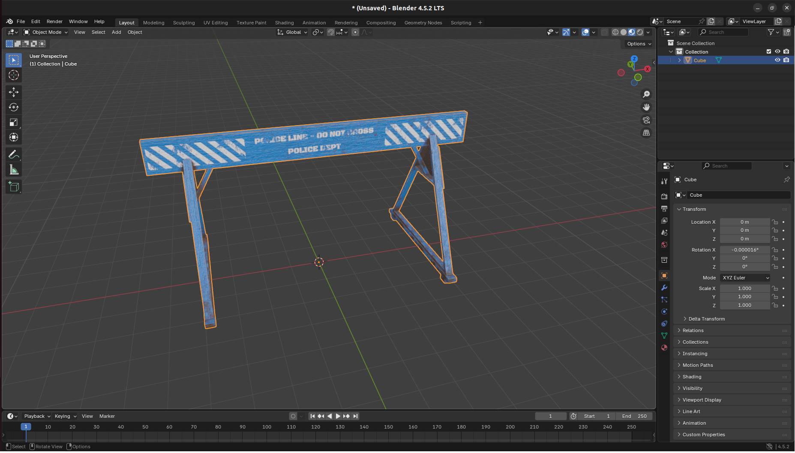
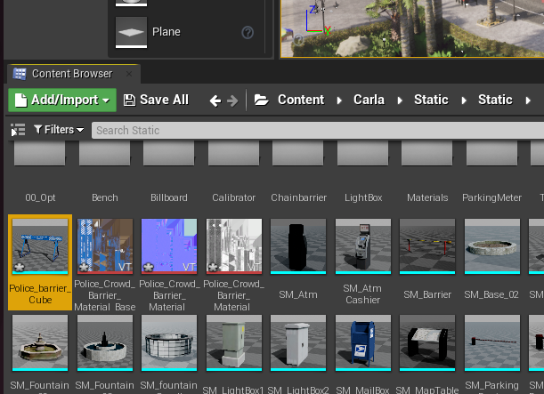

# Content authoring - props

Creating a custom prop in CARLA is quick and straightforward. 

## Download or model the object in Blender

You may find a 3D asset online on sites like TurboSquid or Sketchfab that suite your usecase - make sure to check that the license suits your intended use. Alternatively, if you are adept at 3D modelling, you may choose to model the object in a 3D modelling application such as Blender. 

For this example, we [download an asset](https://skfb.ly/ozJB6) from Sketchfab that has a creative commons license. First, import the asset into Blender to inspect it and ensure it suits our intended use. The one modification needed is to move the objects origin of geometry to the origin of the scene, since this will serve as our anchor point for the prop in the CARLA simulation.



If the model is not already in FBX format, export is as FBX from Blender or your preferred 3D application.

## Import the asset into the Unreal Editor

Now that we have an asset in FBX format, we can import it into the CARLA content library. Launch the CARLA Unreal Engine editor by running `make launch` in the root directory of the CARLA source code repository. Once the editor is open, navigate to an appropriate place in the content directories, we choose `Content/Carla/Static/Static`, where the static meshes for some of the existing CARLA props are stored. Drag the FBX into the content browser, continue with the default options, we can now see our new prop as a static mesh in the content folder:



## Add the prop to the JSON configuration file

To register the asset as a prop and use it through the CARLA API, we need to include it in the configuration file `Default.Package.json` in the `Unreal/CarlaUE4/Content/Carla/Config` directory inside the root folder of the CARLA source code repository. Add a new entry in this file matching the format of the existing entries, locating the static mesh file that you imported:

```json
{
	"props": [
		{
			"name": "ATM",
			"path": "/Game/Carla/Static/Static/SM_Atm.SM_Atm",
			"size": "Medium"
		},
		{
			"name": "Barbeque",
			"path": "/Game/Carla/Static/Dynamic/Garden/SM_Barbecue.SM_Barbecue",
			"size": "Small"
		},

        ...,

		{
			"name": "WarningConstruction",
			"path": "/Game/Carla/Static/Dynamic/Construction/SM_WarningConstruction.SM_WarningConstruction",
			"size": "Medium"
		},
		{
			"name": "PoliceBarrier",
			"path": "/Game/Carla/Static/Static/Construction/Police_barrier.Police_barrier",
			"size": "Medium"
		}
	]
}
```

Relaunch the CARLA Unreal Engine editor with the `make launch` command. Press the play option to launch the simulation and then open a Python script or notebook. Filter for the name you entered in the name field in `Default.Package.json` in lower case and you will find a new blueprint ID for your new prop:

```py
import carla

client = carla.Client('localhost', 2000)
world  = client.get_world()
bp_lib = world.get_blueprint_library()

for bp in bp_lib.filter('*policebarrier*'):
    print(bp.id)
```

This should return:

```sh
static.prop.policebarrier
```

