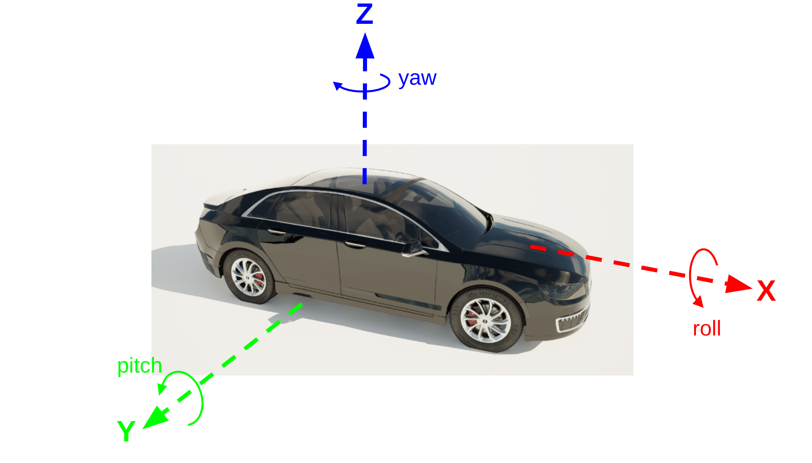

# Coordinates and transformations

This page provides details on the coordinate conventions used in CARLA and how to handle coordinates through the CARLA Python API.

* __[Global coordinates](#global-coordinates)__
* __[Actor coordinates](#actor-coordinates)__
* __[Handling coordinates through the CARLA API:](#handling-coordinates-through-the-carla-api)__
    * [Location](#location)
    * [Rotation](#rotation)
    * [Transform](#transform)
* __[Actor coordinates](#actor-coordinates)__

---

## Global coordinates

CARLA is built on the Unreal Engine version 4.26 and follows the same **left-handed coordinate system**. You can read more details about the Unreal Engine coordinate system in the [Unreal Engine documentation](https://dev.epicgames.com/documentation/en-us/unreal-engine/coordinate-system-and-spaces-in-unreal-engine).

For an observer standing at the origin facing towards the positive X-direction, the following relationships apply:

* **Z** - **Up**
* **X** - **Forward**
* **Y** - **Right**


Distances are measured in meters throughout the CARLA API and angles are measured in degrees. Therefore, it is important to perform relevant conversions when CARLA is interfaced with other applications that might use **right-handed coordinate systems** or use radians for angles or centimeters or imperial measurements for distances. 

---

## Actor coordinates

Vehicles and other actors such as pedestrians have their own local coordinate systems to help maintain locally consistant coordinate relationships such as sensor positions.

By convention, CARLA vehicles are set up such that the front of the vehicle points towards the positive X-axis, the right hand side of the vehicle points towards the positive Y-axis and the top of the vehicle points towards the positive Z-axis. The center of the vehicle's coordinate system is normally close to the center of the bounding box in X and Y and very close to the lowest face of the bounding box in Z. 



CARLA pedestrians are also similarly set up with the pedestrian facing towards the positive X-axis, the right arm facing towards the positive Y-axis, and the head in the positive Z-direction. Pedestrians are normally set up such that the coordinate center is in the middle of the bounding box in the resting pose. 

## Handling coordinates through the CARLA API

The CARLA API has several utility objects for handling coordinates and coordinate transformations. 

### Location

The [Location object](python_api.md#carlalocation) is used to define coordinates and retrieve or apply them in transforms or when spawning or moving objects and actors. 

The following code shows how to create a location object representing a coordinate at X=10m, Y=10m, Z=1m:

```py
# Default constructor with positional arguments
location = carla.Location(10,10,1)

# With keyword arguments
location = carla.Location(x=10,y=10, z=1)
```

---

### Rotation

The [Rotation object](python_api.md#carlarotation) is used to define rotations within the CARLA coordinate system. Rotations are defined in Euler form as roll, pitch and then yaw. The Euler angles are measured in degrees. 

The following code shows how to create a rotation object for a roll of 10 degrees, a pitch of 10 degrees and a yaw of 90 degrees:

```py
rotation = carla.Rotation(roll=10, pitch=10, yaw=90)
```

The keyword arguments can be omitted and the relevant angle will be set to zero. Rotations are applied **intrinsically** in the order **pitch, yaw, roll**.

---

### Transform

The CARLA [Transform object](python_api.md#carlatransform) is used to contain all information about an object's pose, both its 3D location and rotation. A new transform object can be created using a Location and Rotation:

```py
location = carla.Location(10,10,1)
rotation = carla.Rotation(yaw=90)
transform = carla.Transform(location, rotation)
```

This transform can be used to spawn an actor such as a vehicle:

```py
vehicle = world.spawn_actor(vehicle_bp, transform)
```

An actor's transform may be queried using the `get_transform()` method and the associated location and rotation are accessed as attributes:

```py
print(vehicle.get_transform())
print(vehicle.get_transform().location)
print(vehicle.get_transform().rotation)

>>>Transform(Location(x=10, y=10, z=1.0), Rotation(pitch=0.0, yaw=90, roll=0.0))
>>>Location(x=10, y=10, z=1.0)
>>>Rotation(pitch=0.0, yaw=90, roll=0.0)
```

The transform object provides utility functions for applying transforms to other coordinates. The translation and rotation associated with a transform can be applied to a Location or Vector using the `transform()` method:

```
location = carla.Location(1,0,0)
vehicle_transform = vehicle.get_transform()
transformed_location = vehicle_transform.transform(location)

>>>Vector3D(x=10.0, y=11.0, z=1.0)
```

The Transform object also has an `inverse_transform()` method that is useful for finding the coordinates of a world object in the local coordinate frame of an actor:

```
location = carla.Location(1,0,0)
vehicle_transform = vehicle.get_transform()
transformed_location = vehicle_transform.inverse_transform(location)
```

This would be important for exchanging data about nearby vehicles or objects to an AV perception stack, since it will expect data in the vehicle's own coordinate frame. 

---

## Geocoordinates

Geocoordinates are geodetic coordinates given in the format of **latitude**, **longitude** and **altitude** to represent a location on the Earth's surface. The OpenDRIVE definition of a CARLA map (the `.xodr` file) allows a georeference in its metadata. See [this documentation](https://releases.asam.net/OpenDRIVE/1.6.0/ASAM_OpenDRIVE_BS_V1-6-0.html#_georeferencing_in_opendrive) for more information about the georeference in the OpenDRIVE standard. 

In the OpenDRIVE file, the georeference will be provided in the header information in a <geoReference> tag:

```xml
<?xml version="1.0" encoding="UTF-8"?>
<OpenDRIVE>
    <header revMajor="1" revMinor="4" name="" version="1" date="2020-07-28T22:34:58" north="9.9112975471922624e+1" south="-1.7159821787367417e+2" east="1.4036590163241959e+2" west="-1.4497769211633769e+2" vendor="VectorZero">
        <geoReference><![CDATA[+proj=tmerc +lat_0=0 +lon_0=0 +k=1 +x_0=0 +y_0=0 +datum=WGS84 +units=m +geoidgrids=egm96_15.gtx +vunits=m +no_defs ]]></geoReference>
        <userData>
            <vectorScene program="RoadRunner" version="2019.2.12 (build 5161c1572)"/>
        </userData>
    </header>

    ...

```
        
The georeference provided in the OpenDRIVE file is used by the CARLA [Map object](python_api.md#carlamap) to convert between CARLA's world coordinates and geocoordinates. The geocoordinate provided serves as the location at the coordinate center of the map in CARLA, i.e. X=0, Y=0, Z=0. **CARLA uses the [Transverse Mercator projection](https://en.wikipedia.org/wiki/Transverse_Mercator_projection) for converting geolocations**. 

To convert a CARLA coordinate into a geocoordinate, use the `transform_to_geolocation()` method of the Map object:

```py
carla_map = world.get_map()

location = carla.Location(0,0,0)
print(carla_map.transform_to_geolocation(location))

>>>GeoLocation(latitude=0.000099, longitude=0.000090, altitude=1.000000)
```

Geocoordinates can also be converted into CARLA coordinates using the `geolocation_to_transform()` method of the Map object:

```py
geolocation = carla.GeoLocation(latitude=0.000099, longitude=0.000090, altitude=1.000000)
carla_map = world.get_map()
print(carla_map.geolocation_to_transform(geolocation))

>>>Location(x=10.014747, y=11.016221, z=1.000000)
```


