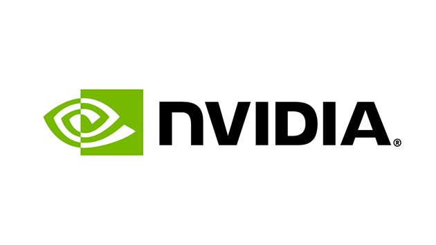

# NVIDIA CARLA Ecosystem

NVIDIA is a multinational technology company and supplier of high-performance GPUs and is a leading developer of artificial intelligence. NVIDIA sponsors the development of the CARLA simulator and supports its advancement through technology contributions useful to the AV simulation community. 

The following sections outline various NVIDIA technologies that have been integrated into CARLA.

# [SimReady](nvidia_simready.md)

SimReady is a 3D standard specification for information and metadata attached to 3D assets intended to be used in simulation. The SimReady standard ensures that a 3D asset is not only a high fidelity visual resource in a digital twin, but also has a well-organized metadata structure to include semantic labelling, dense captions, non-visual sensor information and physical properties. Please refer to the [SimReady documentation](nvidia_simready.md) for details about using SimReady assets in CARLA.

# [Neural reconstruction](nvidia_nurec.md)

NVIDIA's neural reconstruction technology enables a rich 3D representation of an environment to be learned by neural networks from a sequence of sensor data captured in the real world (such as a sequence of 2D camera images or LIDAR data). Variations and randomizations can then be applied in the 3D representation, such as perturbing the trajectory or adjusting the sensor configuration before re-simulation. This facilitates the generation of a diverse range of perturbations of a scenario using only one sequence of recorded sensor data. Neural reconstruction is a powerful tool to diversify training data or testing scenarios. Please refer to the [Neural reconstruction documentation](nvidia_nurec.md) for details on how to install and use the tool.  

# [Cosmos Transfer](nvidia_cosmos_transfer.md)

NVIDIA's Cosmos Transfer is a  branch of [Cosmos World Foundation Models (WFMs)](https://www.nvidia.com/en-us/ai/cosmos/) specialized for multimodal controllable conditional world generation or world2world transfer. Cosmos Transfer is designed to bridge the perceptual divide between simulated and real-world environments.

Users can generate endless hyper-realistic video variations from CARLA sequences using simple text prompts. This capability is ideal for:

* Expanding visual diversity in perception datasets
* Bridging the domain gap for sim-to-real training
* Exploring edge cases with photorealistic textures, lighting, and weather variations

Please refer to the [Cosmos Transfer documentation](nvidia_cosmos_transfer.md) for details on how to use this tool with CARLA. 