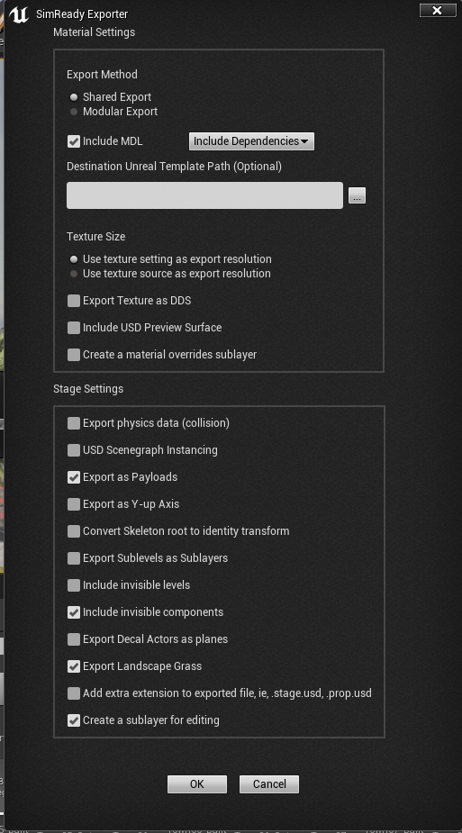

# NVIDIA SimReady

SimReady is a 3D standard specification for information and metadata attached to 3D assets intended to be used in simulation. The SimReady standard ensures that a 3D asset is not only a high fidelity visual resource in a digital twin, but also has a well-organized metadata structure to include semantic labelling, dense captions, non-visual sensor information and physical properties.

## NVIDIA SimReady converter

The NVIDIA SimReady converter enables CARLA assets to be exported to the Universal Scene Description (USD) format in a SimReady compliant way, facilitating import into other applications from the OmniVerse ecosystem such as Sensor RTX or the RTX renderer for co-simulation. 

The SimReady converter maps Unreal objects, properties and parameters to USD/SimReady compliant equivalents, where possible. 

## Exporting an asset with the SimReady converter

To export a map, locate the appropriate map file in the CARLA content browser. For example, *Town10HD_Opt* in `Content > Carla > Maps`.

To export a vehicle or a pedestrian, locate the blueprint file. For example, *BP_Ford_Crown* in `Content >  Carla > Blurprints > Vehicles > Ford_Crown`.

Select the map in the CARLA content browser. Select `File > Export All`. Set `Save as type` to *Universal Scene Description binary SimReady assets for AV Sim (\*.usd)*:

Choose a folder location for the asset. Using the default options to export will work in most cases. 

The `Include MDL` option will convert Unreal materials into MDL materials. Ensure that the application you are exporting for is compatible with MDL materials. Omniverse Kit applications are compatible with MDL materials. 

The `Include USD Preview Surface` option exports the USD with a USD preview surface which ensures a wider compatibility for visualisation, but with a more limited set of material features. This helps ensure that the asset can be viewed correctly in applications that do not support the full MDL specification.

Further details about the export options can be found in the Omniverse Connect documentation [here](https://docs.omniverse.nvidia.com/connect/latest/ue4/manual.html#exporting-to-omniverse-as-usd-and-mdl).

## Semantic labels and Q-codes

The SimReady standard uses [Q-codes](https://en.wikipedia.org/wiki/Q_code) for semantic labelling. The Q-code is a standardised collection of three-letter codes that start 

| Option | Result | 
|--------|--------|
| Export Method | Shared organizes materials so they can be shared by many assets\n Modular exports a  material for every asset so that assets and their materials are all self-contained | 
|Include MDL | Export MDL materials
| MDL Dependency Option | Include Dependencies - Duplicates the MDL dependencies (templates) in Destination Folder  Use Core Library Dependencies - Core MDL Library templates are referenced | 
| Destination Unreal Template Path | Destination Folder on Omniverse Nucleus for the MDL dependencies (templates)  Note: A file must be selected, but only the folder is used |
| Texture Size | Use Texture Setting or Source as Exported Texture Size |
| Export Texture as DDS |  Save DDS Files to Destination Path and reference them from materials |
| Include USD Preview Surface | Export Preview Surfaces |
| Include Unreal Materials | Export a reference to an Unreal material (note, when importing/opening  the material must be available in the within the Unreal project) |
| Create a material overrides layer | Export a sublayer that contains all of the material reference overs for the stage.   Also create USD files for each material rather than including them in the prop stages. |
| Export physics data | Include collision data with static meshes (not available with Unreal Engine 5.0 due to USD Schema updates) |
| Export source geometry for  Nanite high-poly detailed mesh | Brute-force export the Nanite geometry as USD geometry data.  (only available with Unreal Engine 5.0, this generates a LOT of triangles) |
| USD Scenegraph Instancing | Make every referenced mesh in a stage an instance. If the stage has  duplicate meshes this can greatly reduce geometric GPU memory in another renderer, but the editing workflow may be hampered. |
| Export as Payloads | Use Payloads instead of References in the stage |
| Export as Y-up axis | If checked, USD and MDL are exported with a Y-up  stage up-axis rather than the default Z-up |
| Export Sublevels as Sublayers | If checked, levels are exported as USD sublayers  and referenced in the root stage |
| Convert Skeleton root to identity transform | This option will convert a Skeleton’s root node  to an identity transform to assist downstream tools that require this. All animations exported during this export will be transformed properly so they’ll work in downstream tools. |
| Include invisible levels | If checked, levels that are hidden will be included in the export and marked as invisible |
| Export Decal Actors as planes | If checked, decal actors are exported as “floating” plane meshes offset from their base mesh |
| Add extra extension to exports | Stage files will be named .stage.usd, props will be named .prop.usd |
| Checkpoint Comment (Optional) | Set the checkpoint comment on the Nucleus server for each exported file |

