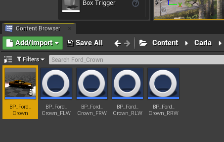
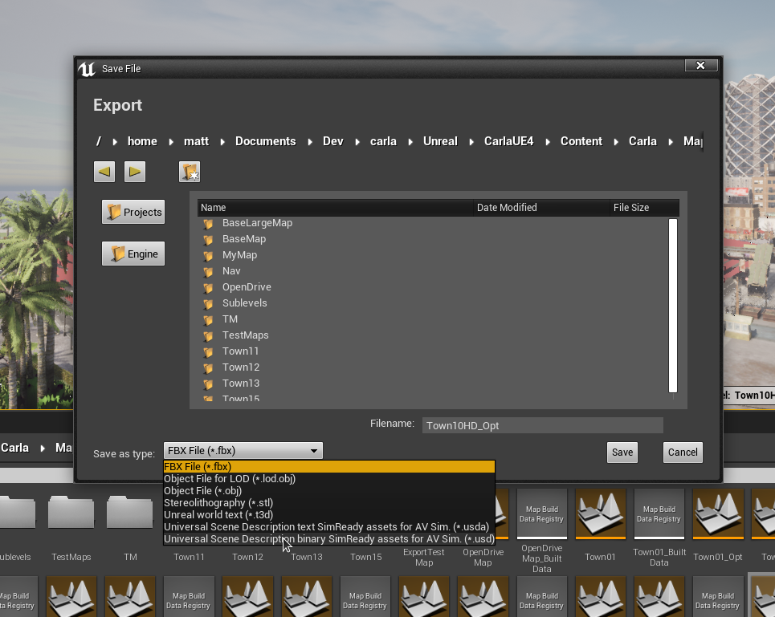

# NVIDIA SimReady

SimReady is a 3D standard specification for information and metadata attached to 3D assets intended to be used in simulation. The SimReady standard ensures that a 3D asset is not only a high fidelity visual resource in a digital twin, but also has a well-organized metadata structure to include semantic labelling, dense captions, non-visual sensor information and physical properties.

## NVIDIA SimReady converter

The NVIDIA SimReady converter enables CARLA assets to be exported to the Universal Scene Description (USD) format in a SimReady compliant way, facilitating import into other applications from the OmniVerse ecosystem such as Sensor RTX or the RTX renderer for co-simulation. 

The SimReady converter maps Unreal objects, properties and parameters to USD/SimReady compliant equivalents, where possible. 

## Exporting an asset with the SimReady converter

To export a map, locate the appropriate map file in the CARLA content browser. For example, *Town10HD_Opt* in `Content > Carla > Maps`.

To export a vehicle or a pedestrian, locate the blueprint file. For example, *BP_Ford_Crown* in `Content >  Carla > Blurprints > Vehicles > Ford_Crown`.

Select the map in the CARLA content browser. Select `File > Export All`. Set `Save as type` to *Universal Scene Description binary SimReady assets for AV Sim (\*.usd)*:

Choose a folder location for the asset. Use the default options to export. 

The `Include MDL` option will convert Unreal materials into MDL materials. Ensure that the application you are exporting for is compatible with MDL materials. Omniverse Kit applications are compatible with MDL materials. 

The `Include USD Preview Surface` option exports the USD with a USD preview surface which ensures a wider compatibility for visualisation, but with a more limited set of material features. This helps ensure that the asset can be viewed correctly in applications that do not support the full MDL specification.

